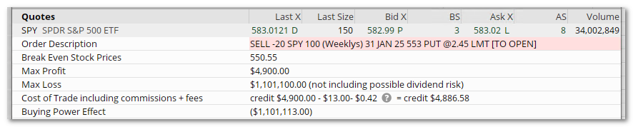
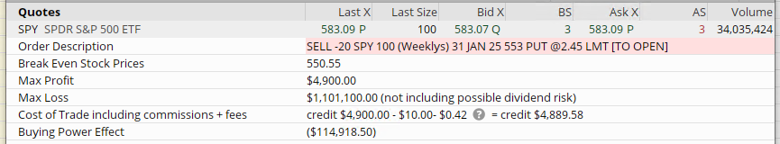
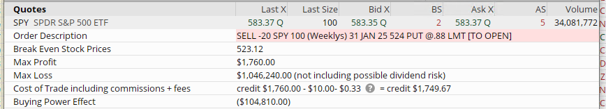
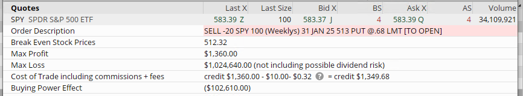
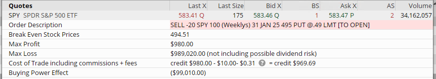
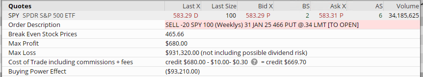

# SPY short put trades

These sample trades were create on 1/2/2025.

## Goal

To sell SPY OTM (out of the money) PUTs for monthly income.

Because there are so many SPY strikes available for trading we can choose our risk/reward level.  Using a portfolio margin account leads to higher monthly return.

## Summary

All sample trades use an expiration that was 29 days out.  
Since we are doing these trades monthly we will be generally selling PUTs every 30 days or so.

| Percent | Monthly Income | Margin | Trade ROI | APR | Notes |
|--|--|--|--|--|--|
| 5% | $4900 | $1,101,113 | 0.4% | 5.3% | This is cash secured and also too risky to consider | 
| 5% | $4900 | $114,918 | 4.2% | 51% | Probably too risky, but if the price point is below some strong support and/or we are in a strong bullish market this would be easy money with an amazing monthly return. |
| 10% | $1760 | $104,810 | 1.6% | 20.1% |
| 12% | $1360 | $102,610 | 1.3% | 15.9% |
| 15% | $980 | $99,010 | 0.9% | 11.8% |
| 20% | $680 | $93,210 | 0.7% | 8.7% |
| 25% | $520 | $88,010 | 0.5% | 7.0% |

**NOTE** - Percent is the amount SPY can drop in price before we start taking a loss on the trade.  15% - 25% might be too conservative but the returns are still better than cash alternatives.  The three largest monthly S&P 500 losses are:

- October 1987: The index fell by approximately **21.8%**, marking the largest one-month loss, primarily due to the event known as "Black Monday" on October 19, 1987. 

- October 2008: During the global financial crisis, the S&P 500 declined by about **16.8%**. 

- March 2020: Amid the onset of the COVID-19 pandemic, the index dropped by approximately **12.5%**. 

## Cash secured PUT

A less desirable trade is cash secured puts.

## Portfolio Margin Puts - more *desirable* than cash secured

5%

10%

12%

15%

20%

25%

